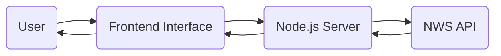

<div align="center">

# ⚡ WEATHER RADAR & ALERTS SYSTEM ⚡

<p align="center">
  <a href="#-features">Features</a> •
  <a href="#-demo">Demo</a> •
  <a href="#-installation">Installation</a> •
  <a href="#-usage">Usage</a> •
  <a href="#-api">API</a> •
  <a href="#-architecture">Architecture</a> •
  <a href="#-roadmap">Roadmap</a> •
  <a href="#-contributing">Contributing</a> •
  <a href="#-license">License</a>
</p>

[](LICENSE)
[](https://nodejs.org)
[](https://developer.mozilla.org/en-US/docs/Web/JavaScript)
[](https://expressjs.com/)
[](CONTRIBUTING.md)

> Real-time weather monitoring system with radar visualization and emergency alerts powered by the National Weather Service API.

</div>

## 🌊 Overview

This application provides a comprehensive weather monitoring system with real-time radar visualization and emergency alerts. Built with Node.js and modern web technologies, it offers an intuitive interface for tracking weather conditions and receiving timely notifications about severe weather events.



## ✨ Features

<table>
  <tr>
    <td>
      <h3>🔮 Dynamic Radar</h3>
      <ul>
        <li>Interactive radar map with pan & zoom</li>
        <li>Multiple radar layer options</li>
        <li>Time-lapse animation controls</li>
        <li>Custom overlay options</li>
      </ul>
    </td>
    <td>
      <h3>⚠️ Smart Alerts</h3>
      <ul>
        <li>Real-time severe weather notifications</li>
        <li>Categorized by severity level</li>
        <li>Detailed event information</li>
        <li>Location-specific filtering</li>
      </ul>
    </td>
  </tr>
  <tr>
    <td>
      <h3>🌡️ Forecast Engine</h3>
      <ul>
        <li>7-day detailed weather forecasts</li>
        <li>Hourly condition predictions</li>
        <li>Temperature, precipitation & wind data</li>
        <li>Historical comparison metrics</li>
      </ul>
    </td>
    <td>
      <h3>📱 Responsive Design</h3>
      <ul>
        <li>Optimized for desktop & mobile</li>
        <li>Adaptive UI components</li>
        <li>Touch-friendly controls</li>
        <li>Progressive loading</li>
      </ul>
    </td>
  </tr>
</table>

## 🚀 Installation

<details>
<summary><b>Click to expand installation steps</b></summary>

### Prerequisites

- Node.js (v14 or higher)
- npm or yarn
- API key for NWS API (optional)

### Step-by-Step Setup

1. **Clone the repository**
```bash
git clone https://github.com/CoreGamer32D/JTSRadar.git
cd weather-alerts-system
```

2. **Install dependencies**
```bash
npm install
```

3. **Configure environment variables**
```bash
cp .env.example .env
# Edit .env with your configuration
```

4. **Build the frontend assets**
```bash
npm run build
```

5. **Start the development server**
```bash
npm run dev
```

6. **Or start in production mode**
```bash
npm start
```

7. **Access the application**
- Open your browser and navigate to `http://localhost:3000`

</details>

## 💻 Usage

### Quick Start Guide

```javascript
// Example: Creating a custom alert monitor
const { AlertMonitor } = require('./utils/alerts');

// Initialize a monitor for a specific location
const monitor = new AlertMonitor({
  lat: 39.7392,
  lon: -104.9903,
  radius: 50, // km
  alertTypes: ['TORNADO', 'SEVERE_THUNDERSTORM', 'FLASH_FLOOD']
});

// Start monitoring
monitor.start();

// Register callback for new alerts
monitor.on('alert', (alert) => {
  console.log(`⚠️ ALERT: ${alert.event} - ${alert.headline}`);
  
  // Take action based on alert severity
  if (alert.severity === 'Extreme') {
    sendEmergencyNotification(alert);
  }
});
```

### Code Snippets

<details>
<summary><b>Frontend Radar Initialization</b></summary>

```javascript
// Initialize the radar display
function initRadar(container, options = {}) {
  const map = L.map(container).setView([options.lat || 39.8283, options.lon || -98.5795], options.zoom || 4);
  
  // Add base map layer
  L.tileLayer('https://{s}.tile.openstreetmap.org/{z}/{x}/{y}.png', {
    attribution: '© OpenStreetMap contributors',
    maxZoom: 18
  }).addTo(map);
  
  // Add weather radar layer
  const radarLayer = L.tileLayer(`https://mesonet.agron.iastate.edu/cache/tile.py/1.0.0/nexrad-n0q-{timestamp}/{z}/{x}/{y}.png`, {
    opacity: 0.7,
    timestamp: new Date().getTime()
  }).addTo(map);
  
  return { map, radarLayer };
}
```
</details>

<details>
<summary><b>Backend Alert Processing</b></summary>

```javascript
// Process and filter alerts
function processAlerts(alertData, userPreferences) {
  return alertData.features
    .filter(feature => {
      // Filter by user preferences
      const properties = feature.properties;
      const severity = properties.severity;
      
      // Check if user wants this severity level
      if (!userPreferences.severityLevels.includes(severity)) {
        return false;
      }
      
      // Check if alert is in user's area of interest
      if (!isPointInPolygon(userPreferences.location, feature.geometry)) {
        return false;
      }
      
      return true;
    })
    .map(feature => {
      // Transform to simplified alert object
      const properties = feature.properties;
      return {
        id: properties.id,
        event: properties.event,
        headline: properties.headline,
        description: properties.description,
        severity: properties.severity,
        urgency: properties.urgency,
        areaDesc: properties.areaDesc,
        sent: new Date(properties.sent),
        expires: new Date(properties.expires)
      };
    })
    .sort((a, b) => {
      // Sort by severity and then by time sent
      if (a.severity !== b.severity) {
        const severityOrder = ['Extreme', 'Severe', 'Moderate', 'Minor', 'Unknown'];
        return severityOrder.indexOf(a.severity) - severityOrder.indexOf(b.severity);
      }
      return b.sent - a.sent;
    });
}
```
</details>

## 📊 API Reference

### Core Endpoints

| Endpoint | Method | Description | Parameters |
|----------|--------|-------------|------------|
| `/api/alerts/:area` | GET | Get active alerts for a specific area | `area`: Area code |
| `/api/radar/:lat/:lon` | GET | Get radar data for coordinates | `lat`: Latitude<br>`lon`: Longitude |
| `/api/forecast/:lat/:lon` | GET | Get weather forecast | `lat`: Latitude<br>`lon`: Longitude |
| `/api/stations` | GET | Get all weather stations | None |
| `/api/history/:station/:date` | GET | Get historical data | `station`: Station ID<br>`date`: ISO date |

### Response Examples

<details>
<summary><b>Alert Response</b></summary>

```json
{
  "alerts": [
    {
      "id": "urn:oid:2.49.0.1.840.0.57dc65e8532caa6a15b69be5ecf2f6bb87d75bc2.001.1",
      "event": "Severe Thunderstorm Warning",
      "headline": "Severe Thunderstorm Warning issued for Denver County",
      "description": "The National Weather Service in Denver has issued a Severe Thunderstorm Warning for Denver County until 7:45 PM MDT",
      "severity": "Severe",
      "urgency": "Immediate",
      "areaDesc": "Denver County",
      "sent": "2025-03-15T18:30:00-06:00",
      "expires": "2025-03-15T19:45:00-06:00"
    }
  ],
  "meta": {
    "updated": "2025-03-15T18:35:00-06:00",
    "count": 1
  }
}
```
</details>

## 🏗️ Architecture

### System Components

```
┌─────────────────────────────────────────────────────────────┐
│                       Client Browser                        │
└───────────────────────────┬─────────────────────────────────┘
                            │
┌───────────────────────────▼─────────────────────────────────┐
│                     Frontend Application                    │
│  ┌────────────────┐  ┌─────────────────┐  ┌──────────────┐  │
│  │   Radar View   │  │   Alert Panel   │  │   Forecast   │  │
│  └────────────────┘  └─────────────────┘  └──────────────┘  │
└───────────────────────────┬─────────────────────────────────┘
                            │
┌───────────────────────────▼─────────────────────────────────┐
│                      Node.js Backend                        │
│  ┌────────────────┐  ┌─────────────────┐  ┌──────────────┐  │
│  │   API Router   │  │  Data Processor │  │  Scheduler   │  │
│  └────────────────┘  └─────────────────┘  └──────────────┘  │
└───────────────────────────┬─────────────────────────────────┘
                            │
┌───────────────────────────▼─────────────────────────────────┐
│                      External Services                      │
│  ┌────────────────────────────────────────────────────────┐ │
│  │               National Weather Service API             │ │
│  └────────────────────────────────────────────────────────┘ │
└─────────────────────────────────────────────────────────────┘
```

### Project Structure

```
weather-alerts-system/
├── 📁 client/                  # Frontend code
│   ├── 📁 public/              # Static assets
│   ├── 📁 src/                 # React components
│   │   ├── 📁 components/      # UI components
│   │   ├── 📁 hooks/           # Custom React hooks
│   │   ├── 📁 services/        # API service integrations
│   │   └── 📁 utils/           # Utility functions
│   └── 📄 package.json         # Frontend dependencies
├── 📁 server/                  # Backend code
│   ├── 📁 api/                 # API route handlers
│   │   ├── 📄 alerts.js        # Weather alerts endpoints
│   │   ├── 📄 radar.js         # Radar data endpoints
│   │   └── 📄 forecast.js      # Forecast endpoints
│   ├── 📁 services/            # External API integrations
│   ├── 📁 utils/               # Helper functions
│   └── 📄 server.js            # Main server entry point
├── 📁 config/                  # Configuration files
├── 📁 scripts/                 # Build and deployment scripts
├── 📄 package.json             # Project dependencies
├── 📄 .env.example             # Environment variable template
└── 📄 README.md                # This file
```

## 🗺️ Roadmap

| Version | Features | Status |
|---------|----------|--------|
| v1.0    | Core radar display and basic alerts | ✅ Complete |
| v1.1    | Forecast integration and mobile responsiveness | ✅ Complete |
| v1.2    | User preferences and location saving | 🚧 In Progress |
| v2.0    | Push notifications and offline support | 📅 Planned |
| v2.5    | Historical data analysis | 📅 Planned |
| v3.0    | ML-powered prediction models | 🔮 Future |

### Upcoming Features

- [ ] **User Accounts System**
  - [ ] Profile management
  - [ ] Saved locations
  - [ ] Alert preferences

- [ ] **Enhanced Notifications**
  - [ ] Push notifications
  - [ ] Email alerts
  - [ ] SMS integration

- [ ] **Advanced Visualization**
  - [ ] 3D radar view
  - [ ] Storm tracking
  - [ ] Lightning strike mapping

## 🤝 Contributing

Contributions are what make the open-source community such an amazing place to learn, inspire, and create. Any contributions you make are **greatly appreciated**.

<details>
<summary><b>How to contribute</b></summary>

### Contributing Guidelines

1. **Fork the Project**
2. **Create your Feature Branch**
   ```bash
   git checkout -b feature/AmazingFeature
   ```
3. **Commit your Changes**
   ```bash
   git commit -m 'Add some AmazingFeature'
   ```
4. **Push to the Branch**
   ```bash
   git push origin feature/AmazingFeature
   ```
5. **Open a Pull Request**

### Code Style

- Follow the existing code style
- Write meaningful commit messages
- Comment your code when necessary
- Write tests for new features

</details>

## 📄 License

Distributed under the MIT License. See [LICENSE](LICENSE) for more information.

## 🌟 Acknowledgements

- [National Weather Service](https://www.weather.gov/) for their comprehensive API
- [Leaflet.js](https://leafletjs.com/) for the interactive mapping capabilities
- [Express.js](https://expressjs.com/) for the robust server framework
- [OpenStreetMap](https://www.openstreetmap.org/) for map tiles

---

<div align="center">
  <p><sub>Developed with ☕ and ❤️</sub></p>
  
  <a href="https://github.com/CoreGamer32D">
    <sub>[ Check out my other projects ]</sub>
  </a>
</div>